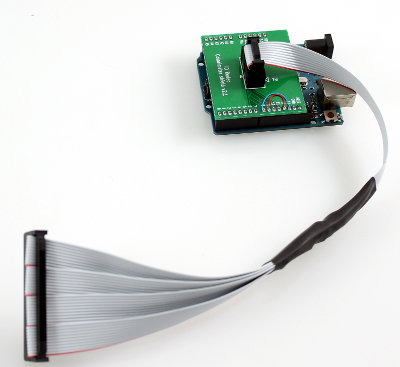

1. TOC
{:toc}

# Arena Board

The arena board organizes panels in a geometry and provides structural integrity to the whole setup. Different shapes of cylindrical arenas have been built. They are often described by their number of panel columns populated and the virtual ones forming a full circle. A 12-12 arena is a closed cylinder formed by 12 columns in total. All columns can be populated in this design, but typically between 1 and 3 are left empty to access the center of the arena.

Most functional designs will have two separate bill of material (BOM). One of the BOM should refer to "BOTTOM", another to "TOP". For a single setup, you will need two arena bards of the same type, one acting as the bottom board, one as the top board.

The BOM for the bottom arena board will usually contain more components. The bottom arena board is where the interconnect board and power are connected to and where the signals from the computer are distributed to the different columns. The top arena board gives structural integrity to the whole setup, it terminates signals, and sometimes provides additional power connectors.

## 12-12 arena board
{:#12-12}

A 12-12 Arena places twelve columns of panels in a regular dodecagon, forming an approximate cylindrical display with 170mm diameter. These are type of arenas are useful for behavioral experiments.

Currently, the most recent version 2 is the most widely used version. Nevertheless, version 4 has some improvements and is designed to minimize noise. This should work, but is not yet widely adapted. All other versions are either deprecated or prototypes.

{:.ifr .pop}

The [Arena 12-12 Version 1](https://github.com/floesche/Arena-G4-Hardware/tree/master/arena_12-12/production_v1) was developed in June 2017. In addition to the connectors approximating an inner circle with 170mm diameter, it had a second row of connectors about 180mm apart. Another visible distinction are eight vias inside the connector ring, which are used for the chip selects. The image on the right shows such an arena board with the ribbon connector on the top left and the power connector on the bottom left.

The [Arena 12-12 Version 2](https://github.com/floesche/Arena-G4-Hardware/tree/master/arena_12-12/production_v2) is similar to version 1 in schematics and most of the pcb layout, but is missing the outer ring of potential connectors. Development on version 2 started in February 2018, with the most recent design iteration from June 2019. [Arena 12-12 Version 2C](https://github.com/floesche/Arena-G4-Hardware/tree/master/arena_12-12/production_v2C) is a prototype to length match all signal lines and decrease electric noise by routing them on individual layers. As a result the board has 12 (hex: `0xC`, hence 2C) layers. In our hands it didn't show improvements over other version 2 boards, but if you are looking to debug timing issues this could be a helpful starting point. Instead, if you want to repair a version 1 or version 2 board, we recommend [arena_12-12_v2.1](https://github.com/floesche/Arena-G4-Hardware/tree/master/arena_12-12/production_v2/arena_12-12_v2p1.zip) as it includes incremental improvements like a more helpful silkscreen.

[Arena 12-12 Version 3](https://github.com/floesche/Arena-G4-Hardware/tree/master/arena_12-12/production_v3) is a prototype with two rings of connectors and additional changes to the physical shape of the PCB. It never left prototyping stage and is here only for historical purposes. This version was designed in June 2019.

[Arena 12-12 Version 4](https://github.com/floesche/Arena-G4-Hardware/tree/master/arena_12-12/production_v4) is the attempt to minimize noise in the system further. To achieve that, the electronic design was changed in August 2019 so that the clock signal is now actively driven by a fan out instead of a simpler voltage translator as in previous versions. Furthermore, the chip select lines are isolated from each other through active components. The circular PCB was physically interrupted to avoid timing issues through circular traces.

Currently, the [arena 12-12 v5](https://github.com/floesche/Arena-G4-Hardware/tree/master/arena_12-12/production_v5) is an experimental design without a [interconnect board](#interconnect) but instead with a direct VHDCI connection. Development is ongoing since Summer 2020, but the design does not work yet.

## 12-18 arena board
{:#12-18}

The 12-18 Arena populates 12 out of 18 sides of a regular octadecagon with panel connectors. This means the approximated cylinder can cover up to 240° of the visual field with a diameter of around 250mm. This type of arena is particularly useful for imaging experiments.

Version 1 and 2 are based on the same schematic, differences are in routing. Also, v2.0 uses hidden vias, is more difficult and expensive to manufacture, and has not been used as often as boards from version 1. Consequently we recommend using the newest version 1 at the moment.

Here we share a 12-18 arena where the board occupies 299×206mm², designed as a PCB with 7 layers. The most stable production ready files are for [arena_12-18-v1.1](https://github.com/floesche/Arena-G4-Hardware/tree/master/arena_12-18/production_v1p1).

There is also a [arena_12-18-v2.0](https://github.com/floesche/Arena-G4-Hardware/tree/master/arena_12-18/production_v2p0) being developed, which has not been yet. It is also more also more difficult and expensive to produce, since it has 7 layers and uses hidden vias. 

## Arena Interconnect Board
{:#interconnect}

Some of the arenas are rotated during experiments and a direct conection of the stiff VHDCI cables would put unnecessary physical stress on the arena board and connector. Therefore the majority of arena boards use a 40pin header which can be used with flexible ribbon cables. The arena interconnect board acts as an adapter between 40pin arena connector and 68pin VHDCI connector from the computer PCIe card. Unfortunately, recent tests suggest, that the ribbon cable introduces noise in the communication. The ribbon cable should be as short as possible to reduce the noise.

This interconnect board is a simple 2 layer PCB within the dimensions of 4.9×8.4mm². The production files are available as [interconnect-v1.2](https://github.com/floesche/Arena-G4-Hardware/tree/master/interconnect/production_v1). The design was done in-house at Janelia. 

Additionally, design files for an [interconnect-v2](https://github.com/floesche/Arena-G4-Hardware/tree/master/interconnect/production_v2) are listed in the repository. They are designed as 4-layer PCBs with additional power connectors and 15pin connector. In theory, they could be used to drive a single column of panels directly. This design is largely untested. We currently recommend using version 1 (see above).

# Historic

## 6 connector arena prototype

The test arena is used to connect the panels with the controller and to supply power to the panels. There are three headers which can be used to connect the panels to the display controller.

- P22 40-Pin (2x20) single SPI bus header.
- P23 60_Pin (2x30) six SPI bus header.
- P30 40-Pin (2x20) six SPI bus w/ common chip select lines.

5V power is supplied to the panels via 2.1mm DC jack, polarity is center positive. 

There are 5 sets of jumpers which can be used to configure the arena.

## Prototype Controller

{:.ifr}

A demonstration controller, based on an Arduino Uno, is provided with the arena and panels. The demonstration controller connects to header P22 on the arena and will display a moving stripe pattern in 16-level gray scale mode.  The panels (up to four) should be connected to header P1 when using the demo controller. Note, the demo controller requires 5V power via the USB connector on the Arduino Uno in order to operate.

The firmware for an Arduino Uno, Arduino Due, and Teensy 3 are in the [panel_g4_firmware](https://github.com/floesche/panels_g4_firmware/tree/master/test_controllers) repository. We cannot find the shields to connect these boards to the test arena at the moment, but they should be fairly easy to reverse engineer. But then again, we cannot think of a use case for the prototype controller or the prototype arena.